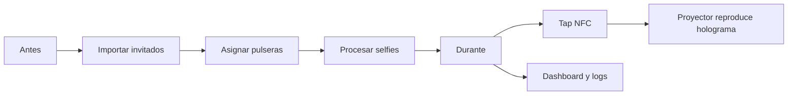
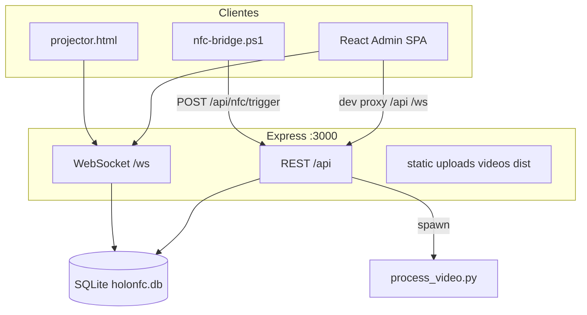
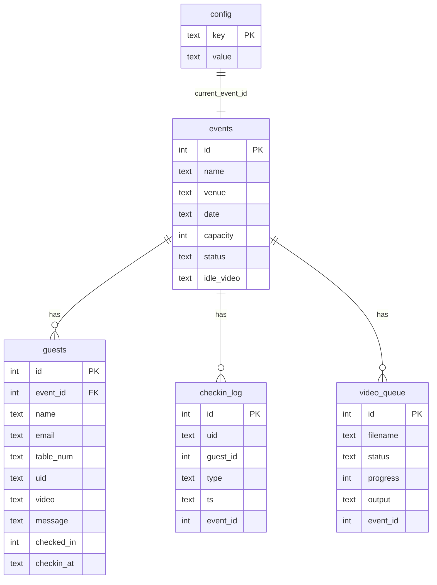

# Documento de Entendimiento — HoloNFC v0.4

Referencia de onboarding técnico del repositorio. Describe qué es el sistema, cómo está armado y qué debe saber quien lo toque. No es una propuesta de cambios de código.

Documentación operativa relacionada:

- [README.md](README.md) — instalación rápida y uso básico
- [KIOSK-SETUP.md](KIOSK-SETUP.md) — arranque Windows / kiosk en venue

---

## 1. Identidad y propósito

| Campo | Valor |
|-------|--------|
| Nombre | **HoloNFC** (npm `holonfc`) |
| Versión | **0.4.0** (`package.json`; UI: `CONTROL · v0.4` en `src/components/Layout.jsx`) |
| Dominio | Operaciones de evento / marketing experiencial |
| Producto | Panel de control para experiencias holográficas en eventos corporativos |
| Usuarios | Azafata/operador en PC local; invitados vía pulsera NFC; proyector en segunda pantalla |
| Modelo de despliegue | **PC Windows en venue** (kiosk), no SaaS multi-tenant |
| Idioma UI/docs | Español (`README.md`, `KIOSK-SETUP.md`) |

**Propuesta de valor:** la azafata gestiona invitados, asigna pulseras NFC, procesa selfies a video con croma, y al tocar el lector el proyector reproduce el holograma del invitado.

---

## 2. Alcance funcional

### Dentro de alcance (implementado)

- Multi-evento: crear / activar / seleccionar / archivar / exportar / eliminar
- CRM de invitados: CRUD, import CSV/XLSX, paginación, check-in simulado
- Asignación de pulseras NFC (modo escaneo con avance automático)
- Check-in físico → proyección holográfica en tiempo real (WebSocket)
- Cola de procesamiento de video con IA (MediaPipe + OpenCV + ffmpeg)
- Dashboard en vivo, logs de check-in, salud/readiness del evento
- Backup SQLite cada 5 min; logs diarios de servidor
- Arranque kiosk Windows (`start-holonfc.bat`, `stop-holonfc.bat`)

### Fuera de alcance (no existe)

- Autenticación, roles, multi-usuario, cloud, CI/CD, tests automatizados
- Pagos, email, storage remoto, SaaS auth
- Detección real de monitores HDMI (UI de pantallas es stub)

### Flujos de operador (día de evento)



---

## 3. Stack y requisitos

| Capa | Tecnología |
|------|------------|
| Frontend admin | React 18, Vite 5, react-router-dom 6, CSS tokens |
| Backend | Node 18+, Express 4, better-sqlite3, ws, multer, cors |
| NFC | `nfc-pcsc` (Node) + `nfc-bridge.ps1` (PowerShell/winscard) |
| Video IA | Python 3.9+, OpenCV, MediaPipe, NumPy, ffmpeg |
| Proyector | HTML/JS vanilla (`public/projector.html`) |
| Empaquetado | npm + pip; sin Docker |

**Scripts npm** (`package.json`): `dev` (server + client + NFC bridge), `client`, `server`, `build`, `preview`.

**Única env relevante:** `PORT` (default `3000`). No hay dotenv de secretos en uso.

---

## 4. Estructura del repositorio

App única (~40 fuentes), no monorepo:

| Ruta | Rol |
|------|-----|
| `src/` | SPA admin (pages, layout, contexts, UI, styles) |
| `server/` | Express, SQLite, WS, NFC, backup, logger |
| `server/routes/` | REST por dominio |
| `processor/` | `process_video.py` + modelos TFLite |
| `public/` | `projector.html`, `videos/` |
| `uploads/` | Videos crudos (gitignored) |
| `data/` | `holonfc.db`, backups, logs, archives (gitignored) |
| `dist/` | Build Vite (gitignored) |

---

## 5. Arquitectura



### Puntos de entrada

| Rol | Archivo |
|-----|---------|
| Bootstrap UI | `src/main.jsx` → `src/App.jsx` |
| Backend | `server/index.js` |
| Proyector | `public/projector.html` |
| Worker video | spawn desde `server/routes/videos.js` |
| NFC Windows | `nfc-bridge.ps1` |

### Rutas admin (`src/App.jsx`)

`/` Dashboard · `/events` · `/invitados` · `/nfc` · `/video` · `/config` · `/logs`

### Estado y tiempo real

- Sin Redux/Zustand: `useState` + `fetch`
- Pub/sub WS vía `src/context/WSContext.jsx`
- Evento actual: `config.current_event_id` (`server/eventCtx.js`)
- Tema: `ThemeContext` + `localStorage` (`hn-theme`)

### Mensajes WebSocket relevantes

`HELLO`, `PING`, `TAG_READ`, `NFC_ASSIGN`, `NFC_STATUS`, `ASSIGN_MODE`, `VIDEO_STATUS`, `CONFIG_UPDATED`, `EVENTS_CHANGED`, `CURRENT_EVENT_CHANGED`, `PROJECTOR_STATUS`, `RELOAD`, errores NFC/proyector.

**Importante:** los “roles” WS (`admin` | `projector`) son etiquetas de cliente, **no seguridad**.

---

## 6. Esquema de datos

Fuente: `server/db.js` → `data/holonfc.db` (WAL, FK ON). Migraciones = `ALTER TABLE` si falta columna.



### Entidades

- **events:** `draft` | `active` | `archived`; seed id `1` “Evento HoloNFC” (no eliminable)
- **guests:** `uid` hex uppercase; `video` = nombre de archivo en `/videos` (no FK)
- **checkin_log:** tipos `IN` | `RESCAN` | `UNKNOWN` | `BLOCKED`
- **config:** key/value (`holo_screen`, `idle_video`, `sim_mode`, `current_event_id`, legacy `event_*`)
- **video_queue:** `queued` / `processing` / `done` / `error` + metadata (duration, model, retry, etc.)

Archivos de archivo de evento: `data/archives/event-{id}/` (`manifest.json`, guests/logs/videos JSON/CSV).

---

## 7. APIs internas

Montaje en `server/index.js`:

| Prefijo | Archivo |
|---------|---------|
| `/api/guests` | `server/routes/guests.js` |
| `/api/events` | `server/routes/events.js` |
| `/api/videos` | `server/routes/videos.js` |
| `/api/config` | `server/routes/config.js` |
| `/api/stats` | `server/routes/stats.js` |
| `/api/logs` | `server/routes/logs.js` |
| `/api/health` | `server/routes/health.js` |
| `/api/nfc/assign-mode`, `/api/nfc/trigger` | inline en `index.js` |

Estáticos: `/uploads`, `/videos`; en prod sirve `dist/` + SPA fallback.

Dev proxy (`vite.config.js`): `/api`, `/uploads`, `/videos`, `/ws` → `:3000`.

---

## 8. Flujos críticos (para quien debuguea)

### Check-in NFC → holograma

1. Lector (bridge o `nfc-pcsc`) → `handleTag` en `server/nfc.js`
2. Lookup guest por `uid` en evento actual → log + check-in
3. Broadcast WS `TAG_READ` con video/mensaje
4. `projector.html` reproduce `/videos/{file}`

### Asignación de pulsera

Modo assign activo → tap → `NFC_ASSIGN` / actualización guest → siguiente en cola UI (`src/pages/AssignNFC.jsx`).

### Pipeline de video

Upload multer (hasta 500 MB) → fila `video_queue` → spawn Python → stdout `PROGRESS:` / `METADATA:` → output en `public/videos/` → WS `VIDEO_STATUS` → asignación a guest desde UI (`src/pages/VideoIA.jsx`).

Resiliencia: timeout, 1 retry, recovery al boot, watchdog (`server/routes/videos.js`).

---

## 9. Complejidad y riesgos técnicos

**Complejidad global:** media-baja en líneas de código; **media-alta en operación** (hardware + realtime + IA + kiosk Windows).

### Hotspots

1. `server/routes/videos.js` — cola, IPC Python, fallos
2. Dual NFC (Node + PowerShell) → mismo `/api/nfc/trigger`
3. Contexto global `current_event_id` (confundir “seleccionado” vs “activo”)
4. Contrato WS admin ↔ proyector
5. `public/projector.html` — JS grande fuera del pipeline React

### Deuda / stubs conocidos

- `sim_mode` y `holo_screen` en config/UI **casi no leídos** por servidor/proyector
- Lista HDMI en Config es **hardcode**, no OS
- React en `devDependencies` (atípico para runtime prod)
- Sin TypeScript ni tipos API compartidos
- SheetJS desde CDN (riesgo offline en venue)
- `stop-holonfc.bat` hace `taskkill` de **todo** `node.exe`
- Sin `requirements.txt` pinneado; sin tests ni CI

### Seguridad

Todo abierto en localhost. Solo seguro como **PC de operador confiable** en red de evento. No exponer a Internet.

---

## 10. Cómo correr y operar

```bash
npm install
pip install opencv-python mediapipe numpy
npm run dev
```

- Admin: http://localhost:5173
- API: http://localhost:3000
- Proyector: http://localhost:3000/projector.html

Producción venue: `npm run build` + `npm run server` (o `start-holonfc.bat`).

Rutas operativas: DB `data/holonfc.db` · backups `data/backups/` (24) · logs `data/logs/` (14 días) · videos `public/videos/` · uploads `uploads/`.

Detalle kiosk: [KIOSK-SETUP.md](KIOSK-SETUP.md).

---

## 11. Convenciones para contribuidores

- ESM (`"type": "module"`), solo `.js` / `.jsx` / `.py`
- Páginas: default export en `src/pages/`; UI compartida en `src/components/ui/`
- Rutas Express: `Router` default export por dominio
- Design system: variables en `src/styles/tokens.css` (paleta Cobalt), tema `data-theme`
- Strings de operador en español; logs/código mezclan EN/ES
- Sin framework de tests: validar con readiness + flujos manuales / `POST /api/nfc/trigger`

### Mapa mental “dónde tocar qué”

| Necesidad | Dónde |
|-----------|--------|
| Nueva pantalla admin | `src/pages/` + ruta en `App.jsx` + Layout nav |
| Nuevo endpoint | `server/routes/*.js` + mount en `index.js` |
| Cambio de schema | migraciones en `server/db.js` |
| Comportamiento NFC | `server/nfc.js` (+ bridge si Windows) |
| Mensaje realtime | `server/ws.js` + listeners en `WSContext` / proyector |
| Pipeline IA | `processor/process_video.py` + `routes/videos.js` |
| UX proyector | `public/projector.html` |

---

## 12. Resumen ejecutivo

**HoloNFC v0.4** es un sistema local Windows de control de evento: panel React + API Express/SQLite/WebSocket + lector ACR122U + procesador MediaPipe + proyector fullscreen. Alcance acotado a operaciones on-site, sin auth/cloud/CI. Quien trabaje aquí debe priorizar el contrato realtime, el scope por `current_event_id`, la resiliencia de la cola de video y la realidad de hardware/kiosk Windows frente a la simplicidad aparente del código.
